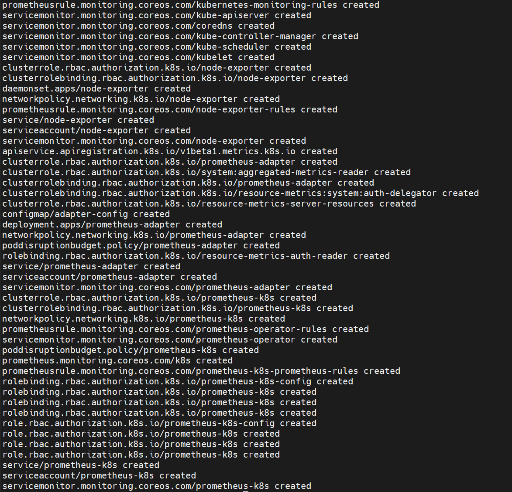
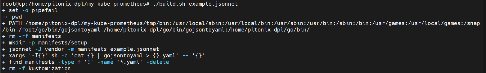
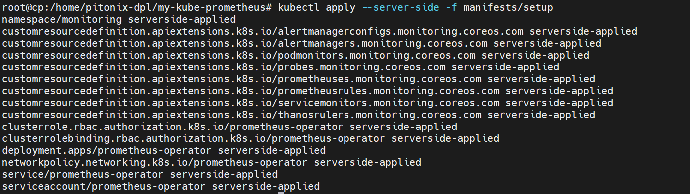
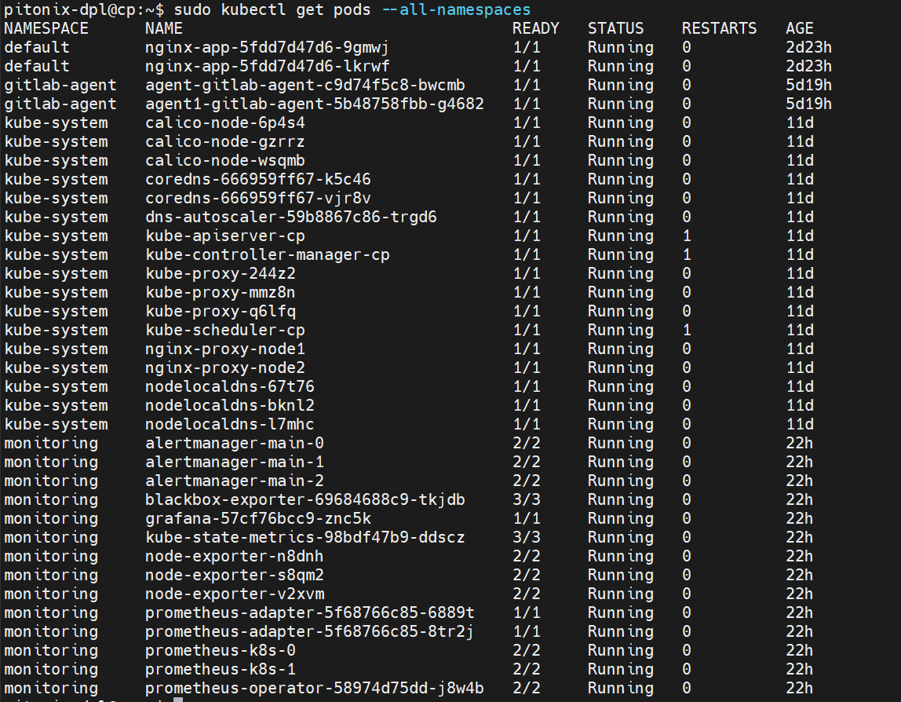
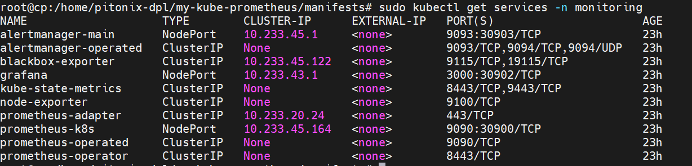

# Diploma_ND9-monitoring

## Система мониторинга для кластера Kubernetes

В данном репозитории загружены манифесты Kubernetes, которые были сгенерированы библиотекой Kube-prometeus.
Для доступа к Grafana из вне, был раскомментирован тип сервиса NodePort, а в конфигурацию Yandex Cloud (репозиторий Terraform) внесен дополнительный обработчик для балансировщика на порт Grafana.
Стандартная network-policy для Grafana удалена.

Для доступа к интерфейсу можно пройти по [ссылке](http://84.201.130.110:8080/login) 
Данные для доступа: aak74 Qaz123Wsx

Генерация манифестов

Установка

Окончательный список подов

Службы
